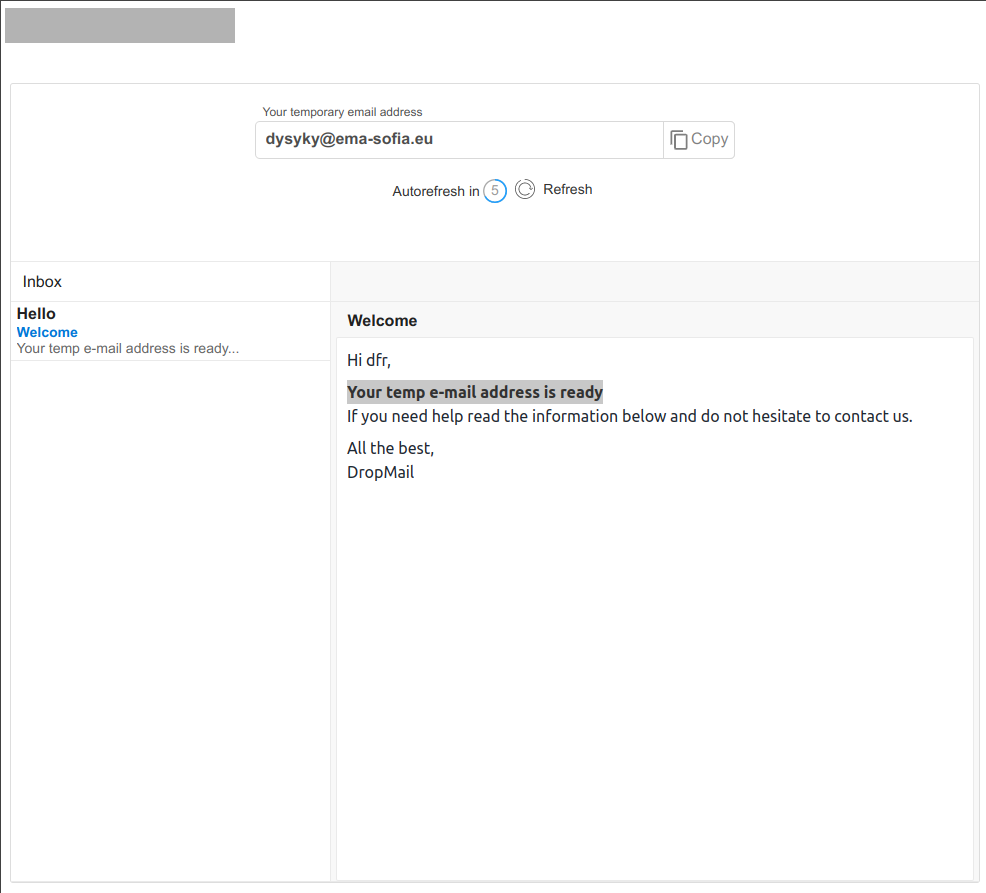

# DropMail.me Challenge

## Introdução

Este é um desafio para testar seus conhecimentos de Front-end;

O objetivo é avaliar a sua forma de estruturação e autonomia em decisões para construir algo escalável utilizando o Framework sugerido na vaga aplicada.

### Antes de começar
 
- Prepare o projeto para ser disponibilizado no Github, copiando o conteúdo deste repositório para o seu (ou utilize o fork do projeto e aponte para o Github). Confirme que a visibilidade do projeto é pública (não esqueça de colocar no readme a referência a este challenge);
- O projeto deve utilizar a Linguagem específica na sua Vaga (caso esteja se candidatando). Por exempo: Python, R, Scala e entre outras;
- Considere como deadline 5 dias a partir do início do desafio. Caso tenha sido convidado a realizar o teste e não seja possível concluir dentro deste período, avise a pessoa que o convidou para receber instruções sobre o que fazer.
- Documentar todo o processo de investigação para o desenvolvimento da atividade (README.md no seu repositório); os resultados destas tarefas são tão importantes do que o seu processo de pensamento e decisões à medida que as completa, por isso tente documentar e apresentar os seus hipóteses e decisões na medida do possível.

## Case

Sites e serviços online geralmente exigem um endereço de e-mail válido para registrar, acessar ou receber conteúdo protegido, etc. No entanto, o problema é que alguns desses sites podem usar nossos endereços de e-mail para enviar mensagens indesejadas. As pessoas não querem se preocupar mais com spam, propagandas no email, hackers e ataques de robôs.

Uma boa maneira de lidar com isso é usar um endereço de e-mail temporário se você não tiver certeza de que este site é absolutamente confiável e confiável. Dessa forma, você pode manter seus e-mails longe de spam e proteger sua privacidade. Sua tarefa para esse case será desenvolver uma aplicação que consuma uma API de email temporário para que os usuários possam utilizar serviços sem expor seu email real, seguindo os requisitos propostos neste desafio.

## Recursos

1. Estudar a documentação da REST API: https://dropmail.me/api/
2. Utilizar Frameworks CSS, recomendamos alguns como:

    - Tailwind CSS: https://tailwindcss.com/
    - Material UI: https://material-ui.com/
    - Angular Material: https://material.angular.io/
    - Bootstrap: https://getbootstrap.com/
    - Bulma: https://bulma.io/
    - Outro de sua preferência

## Tela para Desktop

## Tela para Mobile

A versão desktop deve ser criada e adaptada para exibir todos os elementos presentes na versão desktop.

## API

Para obter os dados, utilizaremos a API do DropMail. Observe que a comunicação é realizada utilizando [GraphQL](https://graphql.org/), enviando todas as requisições para o endereço https://dropmail.me/api/graphql/MY_TOKEN (HTTP) ou wss://dropmail.me/api/graphql/${AUTH_TOKEN}/websocket (WebSocket). Para se comunicar nestes formatos, é possível usar um cliente (por exemplo, o Apollo) ou utilizar um cliente do tipo Axios.

Conforme explicado na documentação, você pode usar qualquer string única de 8 caracteres ou mais como ${MY_TOKEN}.

> Nota: caso tenha problemas de CORS, sugerimos que utilize uma ferramenta como, por exemplo, [https://cors-anywhere.herokuapp.com](https://cors-anywhere.herokuapp.com)

## Obrigatórios

**Obrigatório 1 -** Você deverá atender aos seguintes casos de uso:

- Como usuário, posso gerar um endereço de email temporário;
- Como usuário, posso copiar o endereço de email gerado;
- Como usuário, posso visualizar a caixa de entrada deste email;

**Obrigatório 2 -** Para capturar a chegada de novos emails, você deve verificar a caixa de mensagens a cada 15 segundos.

**Obrigatório 3 -** Adicione um novo botão chamado "Receber notificações". Este botão irá ativar a notificações na área de trabalho quando chegar um novo email, caso a tab não esteja em foco. Caso o usuário não aceite, o botão deve permitir que, se clicado, abra novamente a mensagem para liberar este recurso do navegador.

**Obrigatório 4 -** Seguir a base do [mockup](assets/desktop.png) (estilização ao seu critério)

**Obrigatório 5 -** Salve os dados de acesso ao email no localstorage ou sessionstorage, para que a conta não seja perdida ao atualizar a página. Caso o email tenha expirado, é necessário remover esse registro do storage.

## Extras

Além do desafio proposto temos alguns diferenciais:

**Diferencial 1 -** Escrever Unit Tests ou E2E Test. Escolher a melhor abordagem e biblioteca;

**Diferencial 2 -** Configurar Docker no Projeto para facilitar o Deploy da equipe de DevOps;

**Diferencial 3 -** Publique o projeto em alguma plataforma, como por exemplo a [Vercel](https://vercel.com/), [Netlify](https://www.netlify.com/) ou outra de sua preferência.

## Readme do Repositório

- Deve conter o título do projeto
- Uma descrição sobre o projeto em frase
- Deve conter uma lista com linguagem, framework e/ou tecnologias usadas
- Como instalar e usar o projeto (instruções)
- Não esqueça o [.gitignore](https://www.toptal.com/developers/gitignore)
- Se está usando github pessoal, referencie que é um challenge by coodesh:  

>  This is a challenge by [Coodesh](https://coodesh.com/)

## Finalização e Instruções para a Apresentação

Avisar sobre a finalização e enviar para correção.

1. Confira se você respondeu o Scorecard anexado na Vaga que se candidatou;
2. Confira se você respondeu o Mapeamento anexado na Vaga que se candidatou;
3. Acesse [https://coodesh.com/challenges/review](https://coodesh.com/challenges/review);
4. Adicione o repositório com a sua solução;
5. Grave um vídeo, utilizando o botão na tela de solicitar revisão da Coodesh, com no máximo 5 minutos, com a apresentação do seu projeto. Utilize o tempo para:
- Explicar o objetivo do desafio
- Quais tecnologias foram utilizadas
- Mostrar a aplicação em funcionamento
- Foque em pontos obrigatórios e diferenciais quando for apresentar.
6. Adicione o link da apresentação do seu projeto no README.md.
7. Verifique se o Readme está bom e faça o commit final em seu repositório;
8. Confira a vaga desejada;
9. Envie e aguarde as instruções para seguir no processo. Sucesso e boa sorte. =)

## Suporte

Use a [nossa comunidade](https://discord.gg/rdXbEvjsWu) para tirar dúvidas sobre o processo ou envie uma mensagem diretamente a um especialista no chat da plataforma. 

